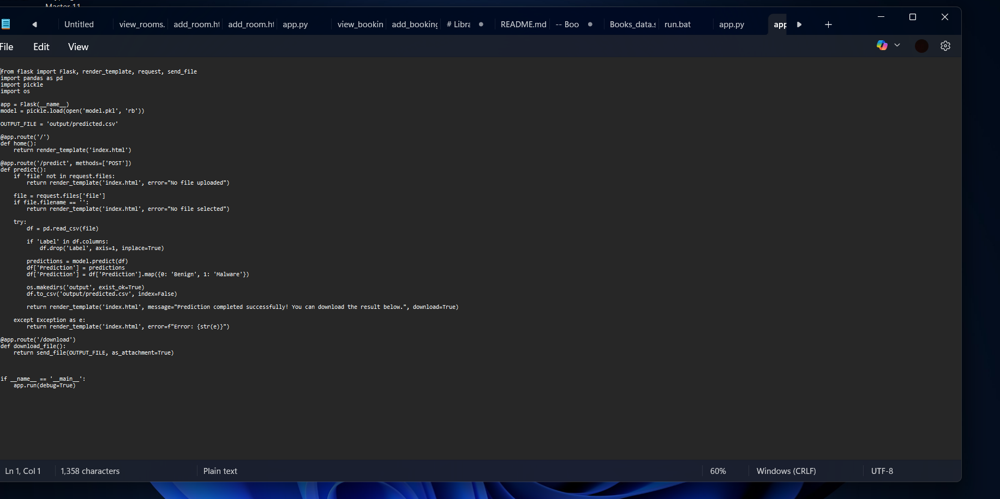
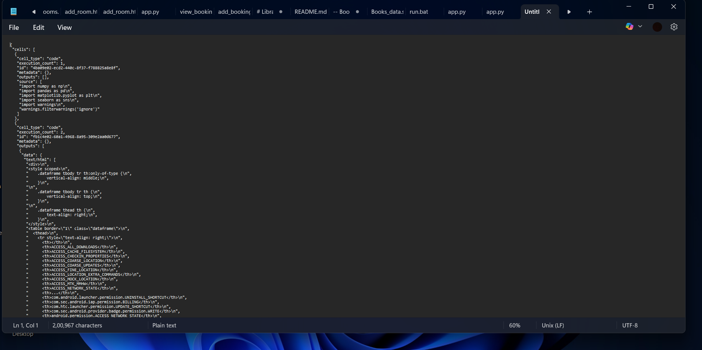
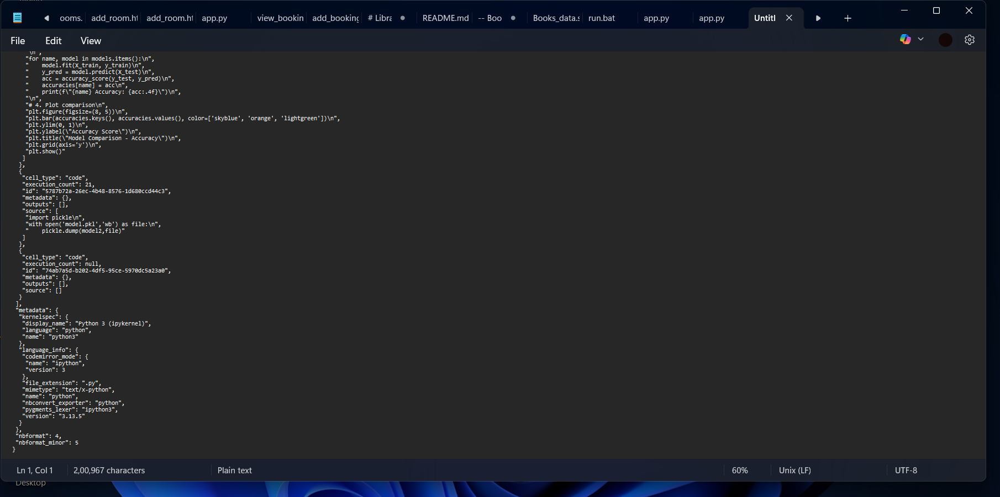

# Machine Learning Enabled Stolen App Detection

## Overview
This project is a machine learning based system to detect stolen or repackaged mobile applications.  
The model analyzes application data and predicts whether an app is genuine or suspicious.

## Technologies Used
- Python
- Anaconda Prompt
- Jupyter Notebook
- Pandas
- NumPy
- Scikit-learn
- Decision Tree Algorithm

- ## My Role
- I worked on data cleaning, model training, testing results, and documentation, and learned how machine learning can be applied to real-world  problems.

## How the Project Works
1. Data is collected and cleaned.
2. Important features are selected from the dataset.
3. A Decision Tree model is trained on the data.
4. The trained model is used to classify applications.

## How to Clone and Run
1. Clone the repository using the command below:
   git clone https://github.com/raniyaasher-bit/machine-learning-enabled-stolen-app-detection.git
   2. Open the project in Jupyter Notebook or any Python IDE.  
3. Install required libraries.  
4. Run the notebook or Python file to see the output.

## Challenges Faced
Understanding the dataset and training the machine learning model correctly was challenging at first, but I learned by practicing and experimenting.

## Files in this Repository
- Notebook file containing the code and model
- Project documentation
- Presentation (PPT)

## Result
The model is able to classify applications based on the given features and helps in identifying suspicious or stolen apps.

## Screenshots

## Future Improvements
- Use a larger dataset
- Try other machine learning algorithms
- Improve accuracy and feature selection

  
